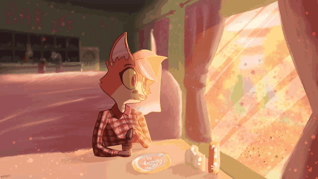

<h1 align="center">Lexi Rose Rogers</h1>

  

  
  
  

---

## About Me

I'm Lexi Rose Rogers, a software developer who builds things with code. I focus on systems programming, web technologies, and creating tools that make development better. I work with GNU/Linux, OpenBSD, and maintain a collection of personal projects and configurations.

## Technologies & Skills

### Languages

### Frameworks & Tools

### Systems & Platforms

- **Operating Systems**: GNU/Linux, Arch Linux
- **Development**: Vim
- **Version Control**: Git
- **Web Technologies**: HTML, CSS, JavaScript, TypeScript, PHP

## Notable Projects

### Miscellaneous

- **[vtubers.tv](https://vtubers.tv)** - streaming service for vtubers
- **[animestream](https://github.com/0x800a6/animestream)** - local anime streaming server
- **[lgbt](https://github.com/0x800a6/lgbt)** - cli tool for generating lgbtq+ flags
- **[author.txt](https://github.com/0x800a6/author.txt)** - provides metadata about the creator or maintainers of a website

### Web & Applications

- **[lrr.sh](https://lrr.sh/)** - Personal website and portfolio

## Connect With Me

  
  
  

### Social Media

  
  
  
  

## Professional Information

- **Location**: Remote
- **Availability**: Open to collaboration and new opportunities
- **Focus**: Systems programming, web development, open source contributions

## Contributing

I welcome contributions to my projects. Here's how you can help:

- Report bugs by opening an issue
- Suggest new features through discussions
- Submit pull requests with improvements
- Share feedback on documentation

**Guidelines:**

- Follow existing code style
- Write clear commit messages
- Test changes before submitting
- Update documentation as needed

## License

Most projects are licensed under the MIT License. Check individual repositories for specific license details.

---

  <i>Thanks for stopping by! Feel free to explore my code and reach out if you have questions.</i>

